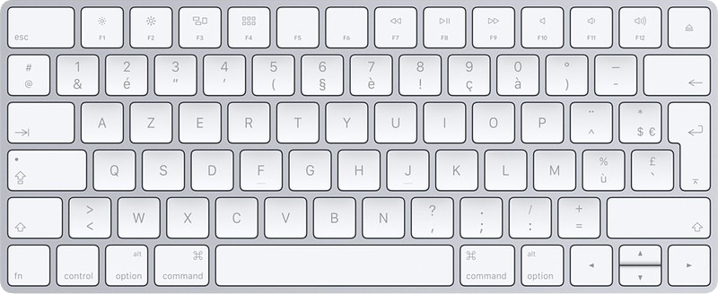

# Layout Apple français AZERTY
Made with Microsoft Keyboard Layout Creator v1.4

# Install
Download [latest release](https://github.com/lmichaudel/apple-azerty-layout/releases/latest), extract the archive and run `setup.exe`.

Head down to keyboard settings in Windows and you should see "Français (Apple, AZERTY)" in the dropdown.

# Uninstall
> [!WARNING]  
> Please make sure that you remove the layout from your active ones!
> Failure in doing so could mess up the uninstallation process.

Simply uninstall "Français (Apple, AZERTY)" in the programs panel in Windows Settings.
